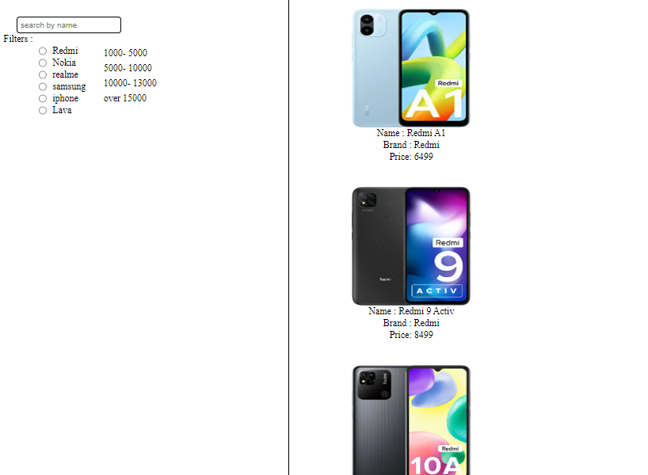
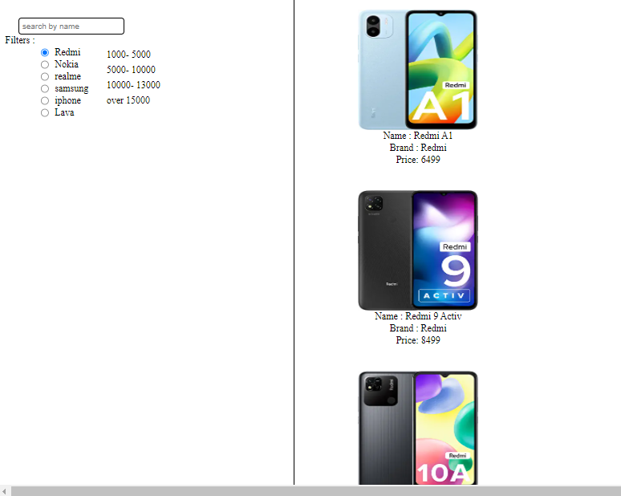
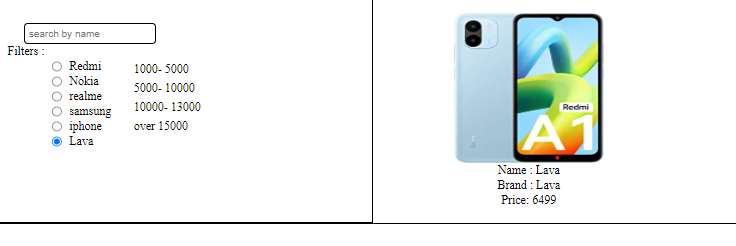
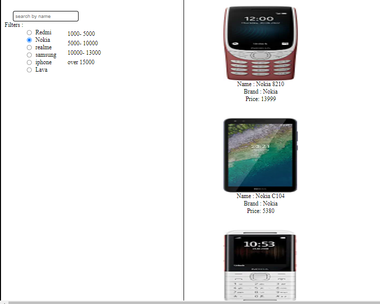
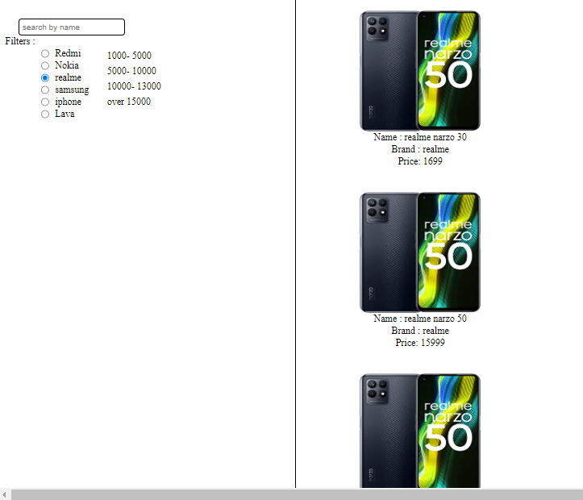
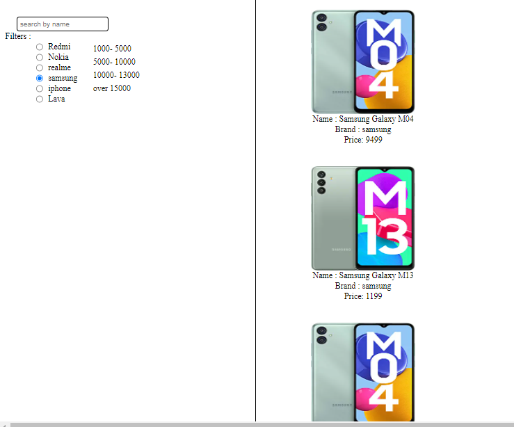
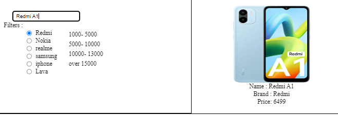

## Project Description

This project is like amazon online shope but in this project only phone collection, we have few phones brand which is listed down , we can filtered by brand name and by price range , we can find a specific phone by his name

## Technology Used :

- Javascript : JavaScript is used to develop the application.
- css : css is used for the style

## What I've Learnt :

I have Learnt :
- javascript function , routing ,crud, 
- search filter

## Setup Project

Get a clone of application from [Here](https://github.com/sachinrao-dev/Book-Management)
open in vs code and install extension live server after that clicked into the live server

Runs the app in the development mode. Open [http://localhost:3000](http://localhost:3000) to view it in your browser.
The page will reload when you make changes. You may also see any lint errors in the console.

## Initial View of Application

## After clicked the Readme brand filter

## After clicked the Lava Brand filter

## After clicked the Nokia brand filter 

## After clicked the RealMe brand  filter  

## After clicked the samsung brand filter  

## After clicked the Search filter  
